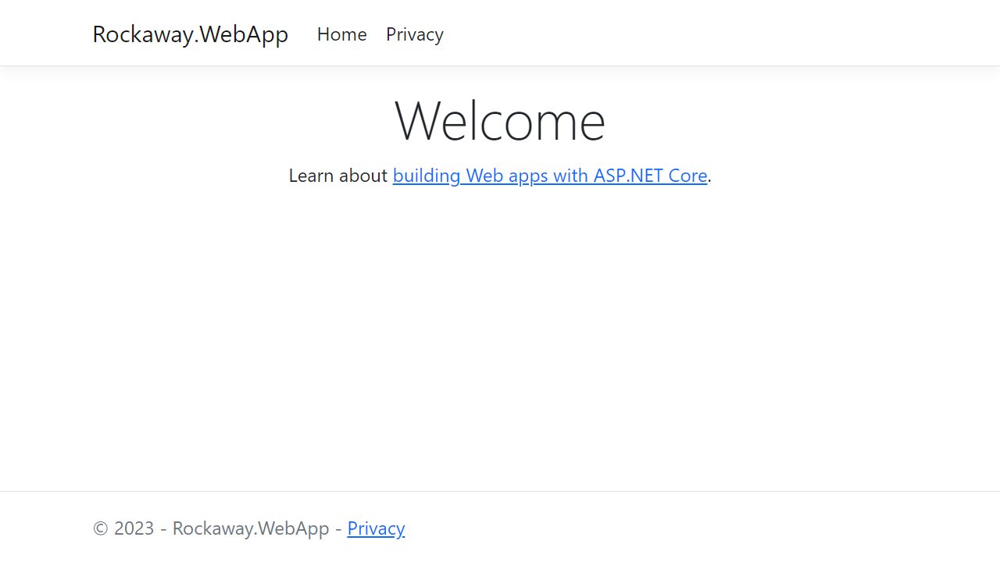
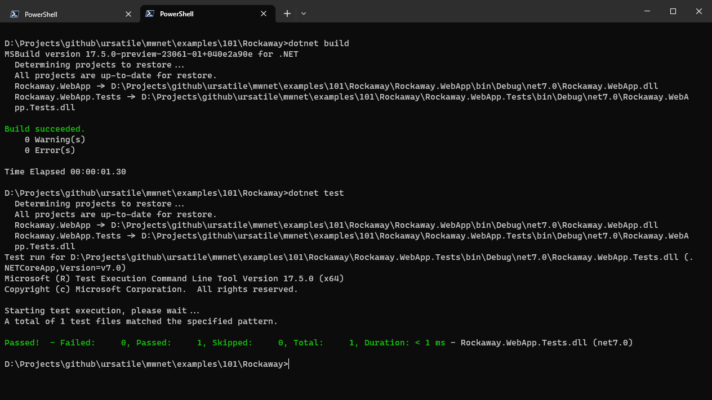

## Our first ASP.NET Core web app

You'll need the `dotnet` runtime installed. Check your version by typing:

```
dotnet --version
```

You'll need `dotnet` version 8 to run the examples in this workshop -- all the principles and patterns here should work on any version of .NET since 5, but we're going to be using some C# language features like primary constructors which aren't supported on any versions below .NET 8.

We're going to set up this project structure:

```
Rockaway/
	Rockaway.WebApp/			Our Rockaway web application
	Rockaway.WebApp.Tests/		xUnit tests for our app
	Rockaway.sln				The .NET solution file used to build our application
```

Start by creating the Rockaway web app:

```
mkdir Rockaway
cd Rockaway
dotnet new razor -o Rockaway.WebApp
```

Now, run it:

```
dotnet run --project Rockaway.WebApp
```

`dotnet` will build and run your project, and somewhere in the console output you'll see a URL - `http://localhost:5088/` or similar

> The port number is generated at random when you create a new project, and it's controlled by the `Properties/launchSettings.json` file.

If you get this screen, it worked.



### Adding a test project

Before we start actually writing code, we're going to set up a few more things which will make life easier for the rest of the project.

First, create a unit test project. We're going to use the xUnit test framework:

```
dotnet new xunit -o Rockaway.WebApp.Tests
```

Create a new solution:

```
dotnet new sln
```

Add both our projects to the solution:

```
dotnet sln add Rockaway.WebApp
dotnet sln add Rockaway.WebApp.Tests
```

Add a reference so that our test project can see our web project:

```
dotnet add Rockaway.WebApp.Tests reference Rockaway.WebApp
```

Check everything's wired up properly:

```
dotnet build
dotnet test
```

Our project doesn't do much yet, but if you see a few lines of green (and no red!), we're all good:



## Formatting code with .editorconfig

.NET includes the `dotnet format` tool, which will clean up and reformat your source code to conform to a particular project style. The coding style used on each project is controlled by a `.editorconfig` file

> Read more about the EditorConfig file format at [https://editorconfig.org/](https://editorconfig.org/)

We're going to add an `.editorconfig` file to our project and use `dotnet format` to keep our code formatted throughout this workshop.

You can find our config file here: [editorconfig](editorconfig)

> **Note**: Jekyll (which I used to write this handbook) won't publish a file starting with a `.`, so you'll need to rename `editorconfig` to `.editorconfig`. To create an `.editorconfig` file within Windows Explorer, you need to create a file named `.editorconfig.` (note the trailing dot), which Windows Explorer will then rename to `.editorconfig` for you. Why? I have no idea.

After adding the `.editorconfig` file, reformat all the files in your project to match the project's new formatting settings.

```
dotnet format
```

### Configuration and Logging

In this workshop, we're going to use the built-in logger that ships with ASP.NET Core, but by injecting instances of `ILogger<T>` into all your components and services, you'll be able to easily switch this for a different logging library later if you need to.

First, let's write some log messages so we've got something to look at. Add this code to `Program.cs`, just below the call to `builder.Build()`:

```csharp
app.Logger.LogTrace("This is a TRACE message.");
app.Logger.LogDebug("This is a DEBUG message.");
app.Logger.LogInformation("This is an INFORMATION message.");
app.Logger.LogWarning("This is a WARNING message.");
app.Logger.LogError("This is an ERROR message.");
app.Logger.LogCritical("This is a CRITICAL message.");
```

Run the project, and watch what appears on the console... the Debug and Trace messages don't appear.

There's an implicit priority to each log level: Critical is the highest priority, and Trace is the lowest, and by default, ASP.NET only logs Information and above (Warning, Error and Critical). Let's see how to change that.

### Environments and appsettings

Configuration in ASP.NET Core is powerful, flexible -- and a little confusing until you get the hang of it.

For now, all you need to know is that our project includes two JSON files:

**`appsettings.json`**: applies regardless of what environment we're running in.

**`appsettings.Development.json`** will override **`appsettings.json`** but only when we're running in the `Development` environment - so it's great for stuff you want to happen on *your* machine but which you don't want to happen when you deploy to production.

Open `appsettings.Development.json` and edit it to look like this:

```json

```

Now run the app again and you should see everything include your `Debug` and `Trace` messages

#### Lowercase URLs

One more thing I like to change right at the start of a project: I don't like mixed-case URLs, and by default, ASP.NET Core will generate links and action URLs that match the names of the classes and methods in our code.

Let's override that. Right before `var app = builder.Build();`, add this line:

```csharp
builder.Services.Configure<RouteOptions>(options => options.LowercaseUrls = true);
```

## Resources and Further Reading

* **Tutorial: Get Started with Razor Pages in ASP.NET Core**
  * [https://learn.microsoft.com/en-us/aspnet/core/tutorials/razor-pages/razor-pages-start?view=aspnetcore-7.0&tabs=visual-studio](https://learn.microsoft.com/en-us/aspnet/core/tutorials/razor-pages/razor-pages-start?view=aspnetcore-7.0&tabs=visual-studio)
