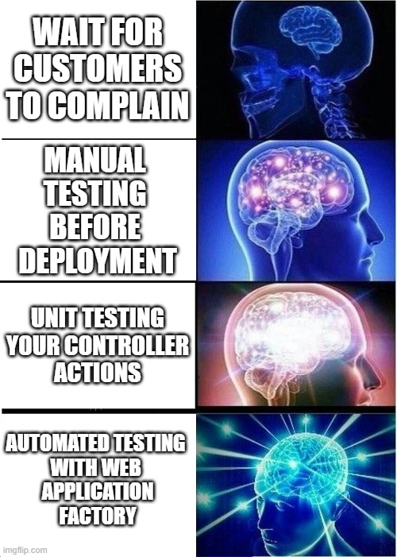

The Rockaway app includes an XUnit test project - but what are we actually testing?

```csharp
// Rockaway.WebApp.Tests/UnitTest1.cs


```

OK... so apart from the fact that it's not actually testing anything, and that `UnitTest1` is a terrible name for a class, we're off to a great start.

## Testing web apps using WebApplicationFactory

At the moment, our app doesn't do very much at all - we've got a homepage and a privacy policy page.

What we want to do is test that those pages exist, and that if we request the correct URL, we get a valid response. This used to be incredibly difficult, but ASP.NET Core introduced something called the `WebApplicationFactory`, which is quite possibly the best single addition to .NET I've seen since I started using C# back in 2002. Seriously, it is amazing.



Let's use `WebApplicationFactory` to plug in an end-to-end test that'll verify that our pages are actually working.

First, install the package. From the `Rockaway` folder:

```dotnetcli
dotnet add Rockaway.WebApp.Tests package Microsoft.AspNetCore.Mvc.Testing
```

> In previous versions of .NET, if you used top-level statements, the compiler would generate the `Program` class for you, but this would be marked as `internal` and so it wouldn't be visible from other projects - like our test project.
>
> Consequently, you'd either have to add an `<InternalsVisibleTo/>` directive to your .csproj file, or to add the line `public partial class Program{}` to your code so that the resulting `Program` class would be public.
>
> In .NET 10, a [source generator is used](https://learn.microsoft.com/en-us/aspnet/core/release-notes/aspnetcore-10.0?view=aspnetcore-10.0#better-support-for-testing-apps-with-top-level-statements) to inject a `public partial class Program{}` declaration into the compiled output, so you don't need to add this yourself

Delete `UnitTest1.cs`, and create a new file.

```csharp
// Rockaway.WebApp.Tests/Pages/PageTests.cs


```

> Notice that we're instantiating `WebApplicationFactory` with `await using`.
>
> `using` indicates we're constructing something that might need cleaning up, so the runtime will call `.Dispose()` on that object once it's no longer in use. `await using` means the clean-up can happen asynchronously, so the runtime will call `await DisposeAsync()` instead of `Dispose`.

Now run our test with `dotnet test` and verify that is passes.
### Exercise

There are two more pages in our sample app - `/privacy` and `/contact`

Add page tests that verify both of these pages return a success status code.


