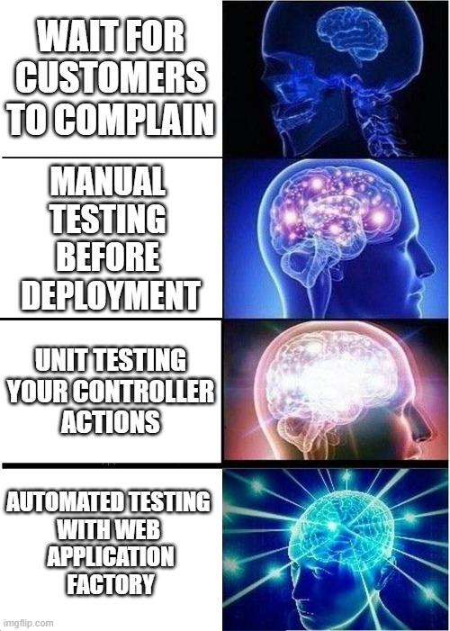

In the previous module, we created an xUnit test project, and ran it, and it passed -- awesome! But what were we actually testing?

```csharp
// Rockaway.WebApp.Tests/UnitTest1.cs


```

OK... so apart from the fact that it's not actually testing anything, and that `UnitTest1` is a terrible name for a class, we're off to a great start.

## Testing web apps using WebApplicationFactory

At the moment, our app doesn't do very much at all - we've got a homepage and a privacy policy page.

What we want to do is test that those pages exist, and that if we request the correct URL, we get a valid response. This used to be incredibly difficult, but ASP.NET Core introduced something called the `WebApplicationFactory`, which is quite possibly the best single addition to .NET I've seen since I started using C# back in 2002. Seriously, it is amazing.




Let's use `WebApplicationFactory` to plug in an end-to-end test that'll verify that our `/status` page is actually working

First, install the package. From the `Rockaway` folder:

```dotnetcli
dotnet add Rockaway.WebApp.Tests package Microsoft.AspNetCore.Mvc.Testing
```

Next, we'll need to modify our project so that we can make our web application's code visible to our testing project.

Now we need to expose our **entry point** to the test project -- which is where it gets a bit gnarly. .NET has a feature called **top level statements**:

```csharp
// top level statements:
Console.WriteLine("Look! Top level statements are awesome!");

// without top level statements:
internal class Program {
  public static void Main() {
    Console.WriteLine("Without top level statements, there's a lot more boilerplate code");
  }
}
```

Behind the scenes, the C# compiler is actually wrapping our code up in a `Program.Main()` method -- but because this all happens by magic, the resulting `Program` class is marked as `internal` -- which means that other projects, like our test project, can't see it.

There are two ways to get around this. One is to modify the `Rockaway.WebApp.csproj` file and add this chunk of XML:

```xml
<ItemGroup>
  <InternalsVisibleTo Include="Rockaway.WebApp.Tests" />
</ItemGroup>
```

> If for any reason this doesn't work with your test runner, the other way is to add a line to our `Program.cs` which explicitly makes our `Program` class `public`:
>
> ```csharp
> // Add this to the end of Program.cs
> 
> public partial class Program {}
> ```

Delete `UnitTest1.cs`, and create a new file.

```csharp
// Rockaway.WebApp.Tests/Pages/PageTests.cs


```

> Notice that we're instantiating WebApplicationFactory with `await using`.
>
> `using` indicates we're constructing something that might need cleaning up, so the runtime will call `.Dispose()` on that object once it's no longer in use. `await using` means the clean-up can happen asynchronously, so the runtime will call `await DisposeAsync()` instead of `Dispose`.

Now run our tests with `dotnet test` and verify they pass.


