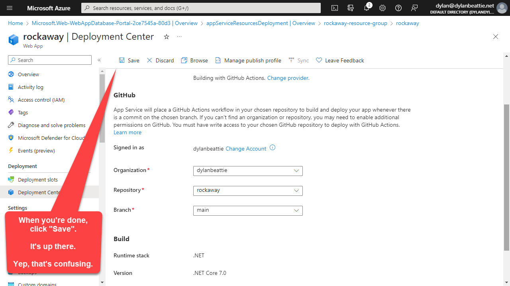

We've got a web app, it's got at least two pages, and we have some tests that prove our pages are working. Time to...

<div style="text-align: center;">

<caption style="text-align: center; font-size: 0.8em:"><br />
<a href="https://www.google.com/search?q=shipt+it+squirrel">"when a squirrel tells you to ship it, you ship it"</a></caption>
</div>
OK, let's create a new app on Windows Azure, and set up a CI pipeline that'll use GitHub Actions to deploy our app every time we push any changes to our main branch.

First, we'll create a new resource. From the Azure portal, click "Create a Resource",


then search for "Web App + Database":


> When I'm creating things in Azure, I use a convention of `<project>-<resource-type>`, which makes it easier to keep track of what's where and, most important, when something isn't being used any more and can safely be deleted.

* Create a new resource group - we'll use `rockaway-resource-group`


You'll need to choose a unique name for your apps and resources which nobody else is using. I've used `rockaway` as my project name here, but you'll need to choose something different because that's *mine*.

* **Resource Group**: `rockaway-resource-group`
* **Region:** whatever you like.
* Web App Details:
  * **Name**: something unique; your app will go live at `{name}.azurewebsites.net` so pick something nobody else is using. We'll use `rockaway-example` in these examples.
  * **Runtime stack**: .NET 8 (LTS) *(LTS is "standard term support", as distinct from "long term support)"*
* Database:
  * **Engine:** SQLAzure
  * **Server name:** `rockaway-example-server`
  * **Database name:** `rockaway-example-database`
* Azure Cache for Redis:
  * No
* Hosting plan:
  * Basic *(for this workshop, anyway!)*

You won't need to add any tags, so the next screen just skip to "Review and Create", and if there's no red warnings, we're good to go! Click "Create", and now go make some coffee or something -- this bit takes about 10 minutes.

## Deploying with GitHub Actions

To set up continuous deployment, we're going to add a Github Actions template that will build and deploy our app every time we push code to the `main` branch in GitHub.

Once Azure has created your new resource group, find your new App Service and look for "Deployment Center":


Authenticate with GitHub, and choose the organisation, project repo, and branch that you want to deploy:



When you press Save, two things happen:

1. Azure pushes a workflow file to your GitHub repo.
2. Azure tries to build and deploy your application. This probably won't work.

### Edit the GitHub Actions workflow file

Change all the referenced actions to `@v3` -- this isn't strictly required, but the old `v1` and `v2` actions use nodeJS 12, which is deprecated.

Remove the line `include-prerelease: true` - we're not using prerelease .NET for this project.

Add a step to the `build:` task which will run all your tests:

```yaml
- name: Test with dotnet test
  run: dotnet test
```

We also need to change our publish step to specify the `Rockaway.WebApp` project name:

```yaml
- name: dotnet publish
  run: dotnet publish Rockaway.WebApp -c Release -o ${{env.DOTNET_ROOT}}/myapp
```

> GitHub Actions steps are all relative to the root folder of the cloned repo, so if your solution file is in e.g. `src/Rockaway.sln`, you'll need to specify this folder in your build steps:
>
> ```yaml
> run: dotnet build src/Rockaway
> ```

The full workflow file is `/.github/workflows/main_rockaway.yml`:

```yaml
# Docs for the Azure Web Apps Deploy action: https://github.com/Azure/webapps-deploy
# More GitHub Actions for Azure: https://github.com/Azure/actions

name: Build and deploy ASP.Net Core app to Azure Web App - rockaway

on:
  push:
    branches:
      - main
  workflow_dispatch:

jobs:
  build:
    runs-on: ubuntu-latest

    steps:
      - uses: actions/checkout@v4

      - name: Set up .NET Core
        uses: actions/setup-dotnet@v3
        with:
          dotnet-version: '8.x'
          include-prerelease: true

      - name: Build with dotnet
        run: dotnet build --configuration Release
      - name: Test with dotnet test
        run: dotnet test

      - name: dotnet publish
        run: dotnet publish Rockaway.WebApp -c Release -o ${{env.DOTNET_ROOT}}/myapp

      - name: Upload artifact for deployment job
        uses: actions/upload-artifact@v3
        with:
          name: .net-app
          path: ${{env.DOTNET_ROOT}}/myapp

  deploy:
    runs-on: ubuntu-latest
    needs: build
    environment:
      name: 'Production'
      url: ${{ steps.deploy-to-webapp.outputs.webapp-url }}

    steps:
      - name: Download artifact from build job
        uses: actions/download-artifact@v3
        with:
          name: .net-app

      - name: Deploy to Azure Web App
        id: deploy-to-webapp
        uses: azure/webapps-deploy@v3
        with:
          app-name: 'rockaway'
          slot-name: 'Production'
          publish-profile: ${{ secrets.AZUREAPPSERVICE_PUBLISHPROFILE_SOME_RANDOM_IDENTIFIER }}
          package: .
```

> The `publish-profile` there is a randomly-generated identifier that's used to look up the actual deployment credentials in GitHub's secrets.

When you push that to GitHub, it should trigger the build action and -- all being well -- build, test, and deploy our code.

### Enable Application Insights

Once we've got a clean deployment, let's turn on Application Insights:


Accept all the defaults and "Apply":


Now, browse to our app using the URL you'll find in your GitHub Actions deployment step:


and there is it. We're live, in the cloud; we can see our website, and if we wait a few moments for AppInsights to gather some data, we can see our app running in Application Insights as well.


Not bad.

