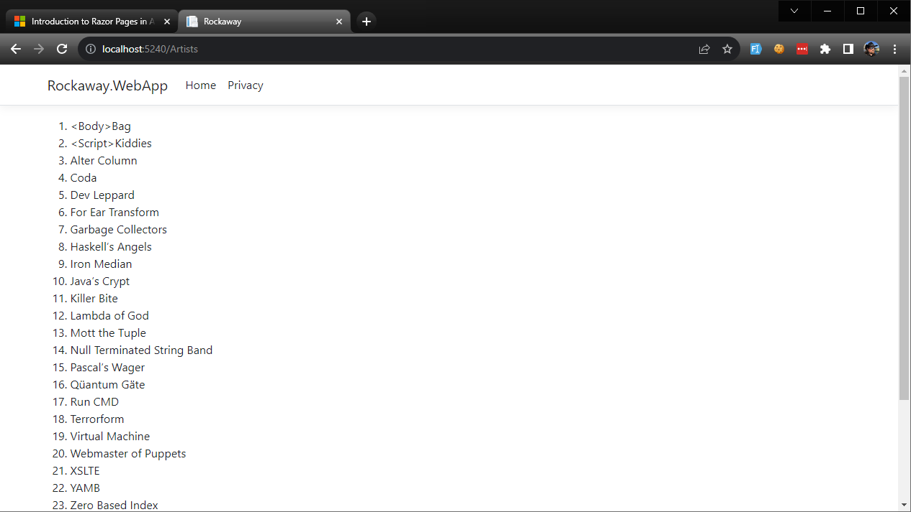

In this module, we're going to start adding some application data to our web app. The business scenario we're modelling here is tickets to rock concerts, so the first thing we're going to add here is a list of artists -- bands and musicians who are going to be performing at the shows we're selling tickets for.

## Installing EF Core

First we'll plug in the NuGet packages we'll need for EF Core support. We're going to install support for both **SQL Server** and **Sqlite** database providers:

```
dotnet add package Microsoft.EntityFrameworkCore.SqlServer
dotnet add package Microsoft.EntityFrameworkCore.Sqlite
```

## The Artist Entity

The `Artist` entity represents a band, performer or musical act.

Create this class in `Rockaway.WebApp/Data/Entities`:

```csharp
// Rockaway.WebApp/Data/Entities/Artist.cs


```

## Working with Sample Data

To populate our in-memory database -- and give us some realistic test data when it's time to go live -- we're going to add a set of sample data entities to our application.

> Sample data should be realistic -- and that means *filth*. Use long names, weird characters, quotes, HTML tags, Unicode extended character sets, emoji... if your sample data covers your edge cases, they'll blow up *right now*, when fixing them is trivial, instead of in six months time when the a real user tries to enter a band called \<Body\>Bag into your database.

We're going to build out our sample data as a set of partial classes. First, there's a core class which contains common helper methods:

```csharp
// Rockaway.WebApp/Data/Sample/SampleData.cs


```

Then there's the sample data for the `Artist` entity, which uses this pattern:

```csharp
// Rockaway.WebApp/Data/Sample/SampleData.Artists.cs

namespace Rockaway.WebApp.Data.Sample;

public partial class SampleData {
	public static class Artists {

		private static int seed = 1;
		private static Guid NextId => TestGuid(seed++, 'A');
		public static Artist AlterColumn = new(
			NextId,
			"Alter Column",
			"Alter Column are South Africa's hottest math rock export. Founded in Cape Town in 2021, their debut album \"Drop Table Mountain\" was nominated for four Grammy awards.",
			"alter-column"
		);

		public static Artist BodyBag = new(
			NextId,
			"<Body>Bag",
			"Speed metal pioneers from San Francisco, <Body>Bag helped define the “web rock” sound in the early 2020s.",
			"body-bag"
		);
```

You can download the full data set here: **[SampleData.Artists.cs](examples/301/Rockaway.WebApp/Data/Sample/SampleData.Artists.cs)**

## The RockawayDbContext

All database access in EF Core is managed via something called a `DbContext`. Our `RockawayDbContext` looks like this:

```csharp
// Rockaway.WebApp/Data/RockawayDbContext.cs


```

Note how we're using the `HasData()` method to populate our `Artists` DbSet with our sample data.

## Registering a DbContext

To use our DbContext, we need to register it in `Program.cs`.

To get our app up and running, we're going to use the Sqlite provider for EF Core:

> SQLite is a C-language library that implements a [small](https://sqlite.org/footprint.html), [fast](https://sqlite.org/fasterthanfs.html), [self-contained](https://sqlite.org/selfcontained.html), [high-reliability](https://sqlite.org/hirely.html), [full-featured](https://sqlite.org/fullsql.html), SQL database engine. SQLite is the [most used](https://sqlite.org/mostdeployed.html) database engine in the world. SQLite is built into all mobile phones and most computers and comes bundled inside countless other applications that people use every day.
>
> *from [https://sqlite.org/](https://sqlite.org/)*

In other words, SQLite is a tiny database engine that doesn't use a server: it runs in the same process as our application code, which makes it perfect for development and testing scenarios where we need to connect a database but we don't *really* care what happens to the data.

We're also using an **in-memory database** - this is created on demand, persists as long as there's at least one open connection to it, and as soon as the final connection is closed, the database is discarded.

```csharp
// Rockaway.WebApp/Program.cs


```

## Using DbContext in Razor Pages

Once our DbContext has been initialised and registered, we can use it in Razor Pages by passing a `RockawayDbContext` into our page code.

Here's a sample page that'll list all the artists in our database, just so we can see how it all works:

`Rockaway.WebApp/Pages/Artists.cshtml`:

```html

```

and the accompanying C# "code-behind" file:

```csharp
// Rockaway.WebApp/Pages/Artists.cshtml.cs


```

Now, when we run our application and point a browser at `/artists`, we get this:



### Testing Data-Driven Pages

To check that our page is rendering the complete list of artists, we can retrieve the list of artists from our `DbContext` inside our test code, and compare what's in the database to what appears on the page:

```csharp

```

> Remember, HTML isn't plain text. A string like `<Script>Kiddies` will appear in your page output as `&lt;Script&gt;Kiddies`, so you'll need to run the HTML through something like `System.Net.WebUtility.HtmlDecode` to turn the HTML entities back into literal text.

### Exercise: Testing Data-Driven Pages

Based on the code and patterns in the artist page tests above, build a test that checks that `/venues` includes the names of every venue in the database.


