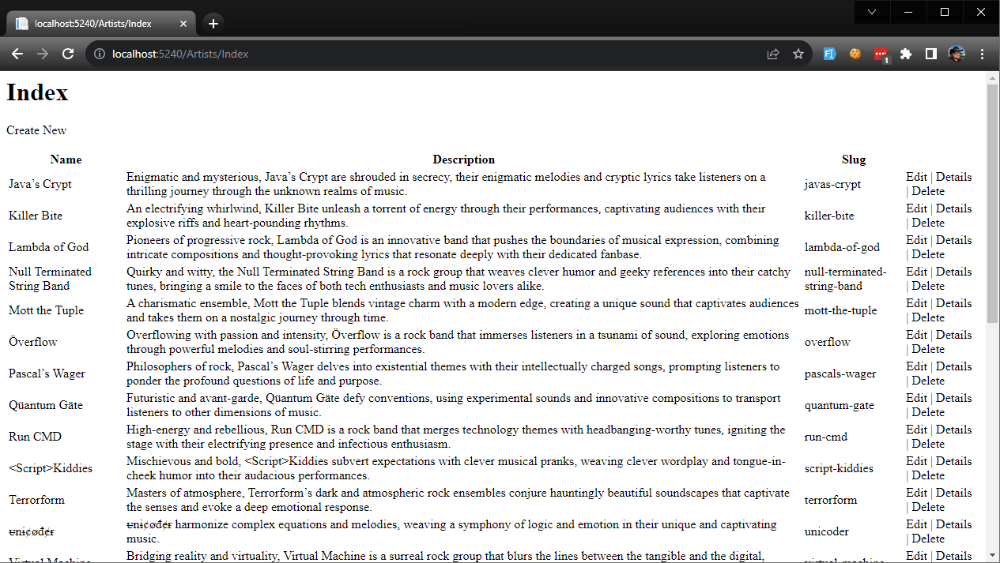
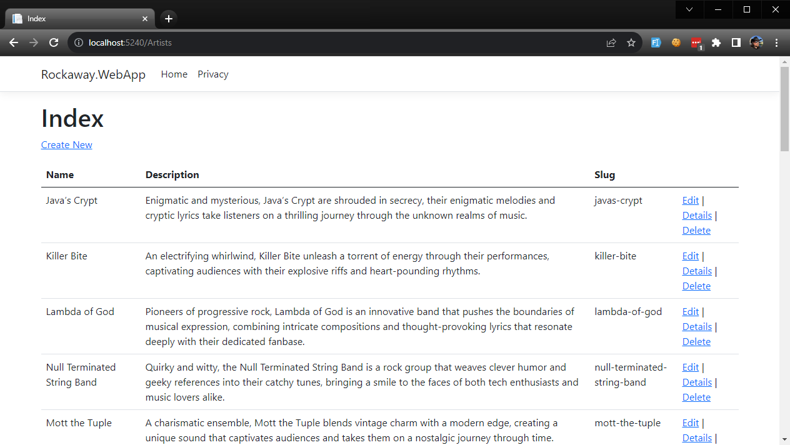

In the last section, we built a simple page that displays a list of artists.

Page-based application models are great for a lot of simpler scenarios, but for more complex workflows and user journeys, the **model/view/controller** pattern has become very popular, and ASP.NET Core includes many powerful features designed to work with this pattern.

We're also going to use some **scaffolding tools** to generate views, controllers and application code for us.

>  The clue about scaffolding code is in the name: **scaffolding**. It's quick to assemble and makes life much easier, but it isn't supposed to last forever.

Our app already includes everything we need to **run** MVC projects, but we don't have the code generation tools yet, so let's install them:

```console
dotnet tool install -g dotnet-aspnet-codegenerator

dotnet add Rockaway.WebApp package Microsoft.VisualStudio.Web.CodeGeneration.Design
dotnet add Rockaway.WebApp package Microsoft.EntityFrameworkCore.Tools
```

Now, we're going to replace our `Artists` page from the last module with an MVC controller.

From the `Rockaway.WebApp` folder, run this command to scaffold the `ArtistsController`:

```dotnetcli
dotnet aspnet-codegenerator controller -name ArtistsController -m Artist -dc RockawayDbContext --relativeFolderPath Controllers --useDefaultLayout --referenceScriptLibraries
```

OK, run it. You should get output something like:

```
Building project ...
Finding the generator 'controller'...
Running the generator 'controller'...

Minimal hosting scenario!
Attempting to compile the application in memory.
Attempting to figure out the EntityFramework metadata for the model and DbContext: 'Artist'
[22:55:48 INF] Serilog support enabled! Yeah!

Using database provider 'Microsoft.EntityFrameworkCore.Sqlite'!

Added Controller : '\Controllers\ArtistsController.cs'.
Added View : \Views\Artists\Create.cshtml
Added View : \Views\Artists\Edit.cshtml
Added View : \Views\Artists\Details.cshtml
Added View : \Views\Artists\Delete.cshtml
Added View : \Views\Artists\Index.cshtml
Added additional file :Views/Shared/_ValidationScriptsPartial.cshtml
RunTime 00:00:18.13
```

We need to wire up support for ASP.NET MVC Controllers and Views by calling 

```csharp
builder.Services.AddControllersWithViews();
```

and then

```csharp
app.MapControllerRoute("default", "{controller=Home}/{action=Index}/{id?}");
```

The whole `Program.cs` should look like this:

```csharp
// Rockaway.WebApp/Program.cs


```

Finally, **delete Artists.cshtml and Artists.cshtml.cs**: if the old page still exists, ASP.NET isn't going to route requests to our new controller properly.

Now, run the app and browse to `/Artists/Index`:



Fun & games... it *works*, but it doesn't look right.

ASP.NET is rendering this page using a Razor view, but the rules which control our page layout are in `/Pages/Shared` and so anything under `/Views/` can't see them.

To fix this, we'll move `_ViewStart.cshtml` and `_ViewImports.cshtml` into the root of `Rockaway.WebApp` - this is a little unconventional, but it's the only way to share declarations between Razor Pages and MVC Views.

Once that's done, our artists page should look like the rest of our app:



