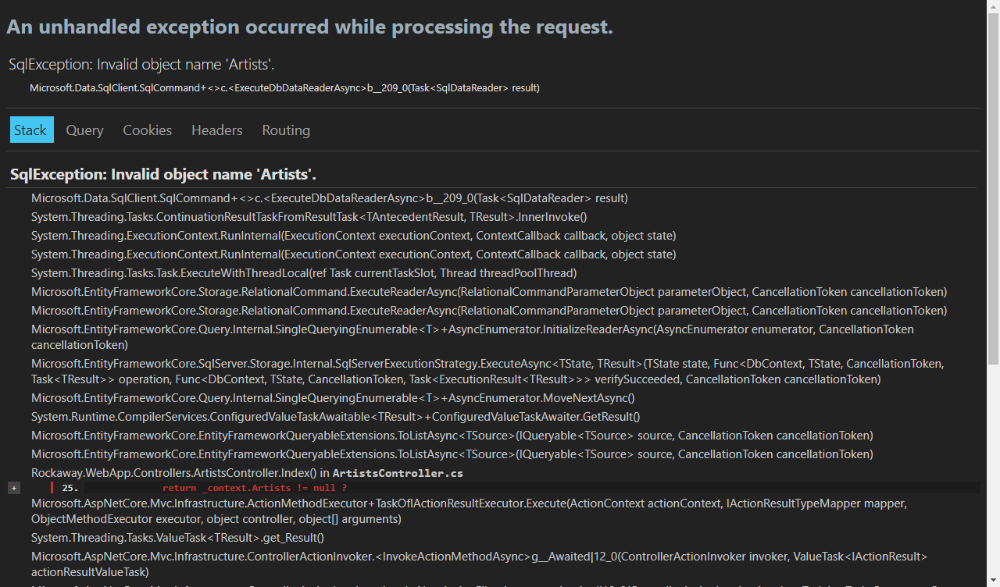

In the last section, we learned how to scaffold controllers and views based on a `DbContext` -- but everything we've done so far has used the `Sqlite` database provider.

To deploy our database, we're going to use another feature of EF Core called **migrations** - but first, we'll need to configure our application to use the SQL Server database provider as well as Sqlite.

ASP.NET has built-in support for three named environments: `Development`, `Staging`, and `Production`.

We're going to use these environments to control the behaviour of our application:

| Environment | Database                                      | Error Pages                     |
| ----------- | --------------------------------------------- | ------------------------------- |
| Development | Sqlite in-memory, created during app startup  | Developer mode exception pages  |
| Staging     | SQL Server, managed using `dotnet ef` tooling | Developer mode exception pages  |
| Production  | SQL Server, managed using deployments         | Production mode exception pages |

We'll create an extension class to manage our hosting configuration:

```csharp
// Rockaway.WebApp/Hosting/HostEnvironmentExtensions.cs


```

Now we need to modify `Program.cs` to pick up our new configuration:

```csharp
// Rockaway.WebApp/Program.cs


```

We also need to add a connection string, which we'll put in `appsettings.Staging.json` so that it's only picked up when we're running in `Staging` environment. We're using `AZURE_SQL_CONNECTIONSTRING` as the name of our connection string because it'll make things a little easier in the next step.

```json

```

And, of course, you'll need a database to connect to. See [SQL Server on Docker](sql-server-on-docker.html) for notes on running SQL Server using Docker.

Once that's all set, we need to run our app in Staging mode to check it works:

```
dotnet run --environment Staging
```

Browse to /Artists and...



OK - we have a database, but no tables. Let's create them.

> You'll need the [CLI Tools for Entity Framework Core](https://learn.microsoft.com/en-us/ef/core/cli/dotnet) installed for these steps.
>
> Install these using:
>
> `dotnet tool install --global dotnet-ef`
>
> or, if you've already got an earlier version of the tools installed, you can update them to .NET 8 using
>
> ```
> dotnet tool update --global dotnet-ef
> ```
> Verify the installation by typing
>
> `dotnet ef`
>
> and if you get a cute little ASCII unicorn:
>
> ```
>                      _/\__
>                ---==/    \\
>          ___  ___   |.    \|\
>         | __|| __|  |  )   \\\
>         | _| | _|   \_/ |  //|\\
>         |___||_|       /   \\\/\\
>
> Entity Framework Core .NET Command-line Tools 8.0.1
> ```
>
> you're good to go.

First, we'll create a **migration** which will populate an empty database with our entities and sample data:
```
dotnet ef migrations add InitialCreate -- --environment Staging
dotnet format
```

> Note that the first  `--` here tells the `ef` tooling "we're done - any arguments after here aren't for you, they're for `dotnet` "

Taking a look at our new migration, there are two things I want to fix.

1. `Artists` are saved to a table called `Artists` (plural). I don't like that. I want `Artists` in a table called `Artist`, because each record is a single artist.
2. There should be a database index with a `unique` constraint on `Artist.Slug` -- the index to improve performance, and the unique constraint because we can't have two artists with the same slug value.

We can fix both of these in the `OnModelCreating` method of our `RockawayDbContext`

First, remove the migration:

```
dotnet ef migrations remove -- --environment Staging
```

Now we can update `RockawayDbContext`:

```csharp
// Rockaway.WebApp/Data/RockawayDbContext.cs


```

and create our migration again:

```dotnetcli
dotnet ef migrations add InitialCreate -- --environment Staging
dotnet format
```

OK, now we can update our local SQL Server database:

```dotnetcli
dotnet ef database update -- --environment Staging
```

Because we've called `HasData()` as part of our data model definition, this will also populate the database with our sample artist data.

Check it one more time:

```
dotnet run --environment Staging
```


