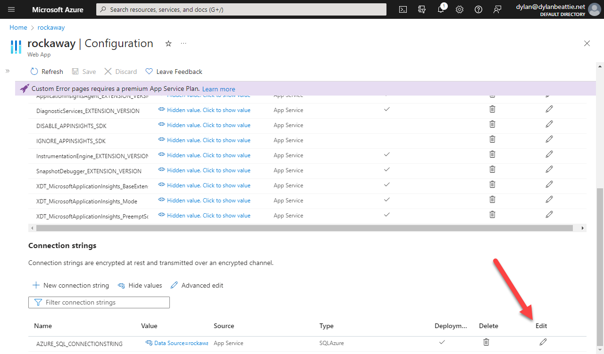
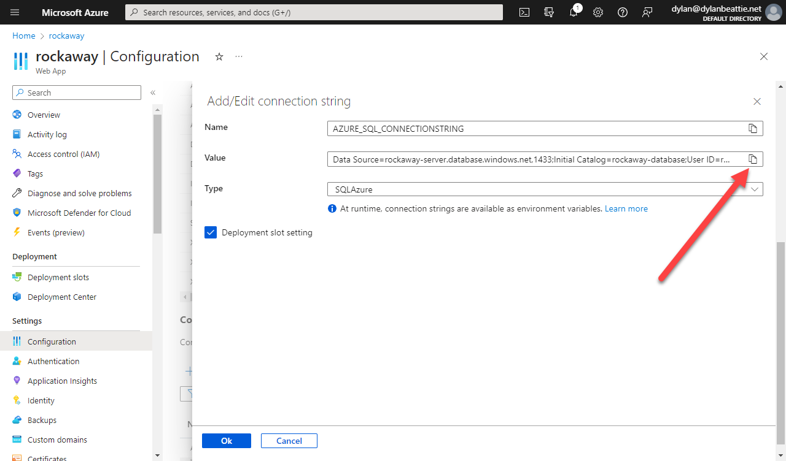
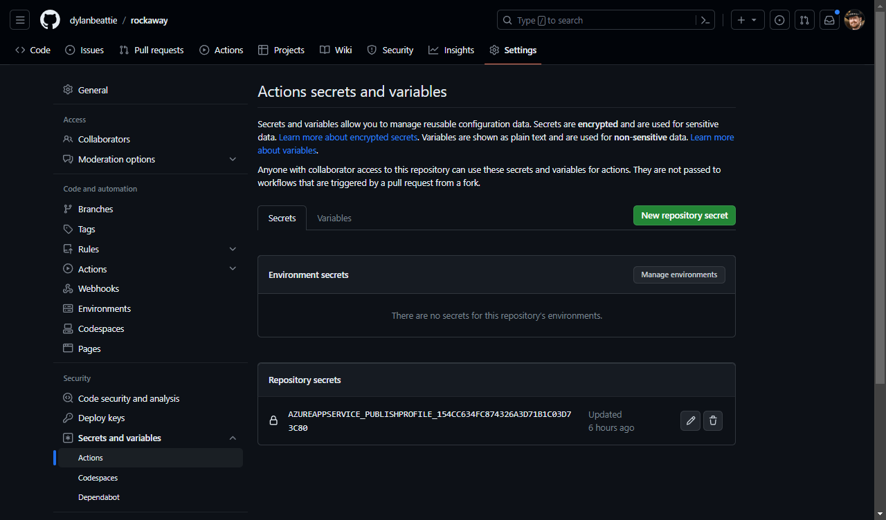
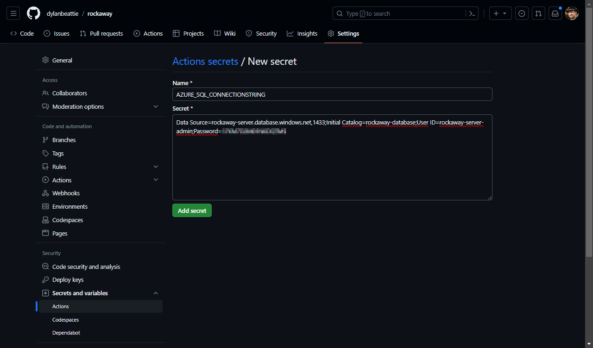

By the end of the last section, we'd created a database migration and applied it to our local database.

Now, we need to do the same thing to the SQL Azure instance that's hosting our database in the cloud, which is where things get a little tricky.

There are several different ways to do this - and they all kinda suck.

### Apply migrations when the app starts

We could call `dbContext.Database.Migrate()` during application startup. If you're only deploying to a single server, this works, but it can make your app much slower to start up. If you're deploying to multiple servers in a web farm, this can go horribly wrong when two apps both try to migrate the same database at the same time.

### Apply migrations manually using SQL Scripts

We can use EF migrations to generate SQL scripts, which we then run against our database server (or give to somebody else so they can run the migration for us.)

Don't like it. As a developer, I don't *want* that kind of access to a production database server.

### Apply migrations using a bundle

EF can create a self-contained executable for us, which we can deploy into Azure and run. This works pretty well, but always felt like an unnecessary step. After all, we already *have* an executable that knows how to migrate our database... our web app can do that!

### Add a migration mode to our web app

Bingo. The least sucky option.

We're going to modify our web app so that we can pass in a command line switch that'll start the app, apply any pending database migrations, and then exit. Then we're going to call our app from a Github Actions step, and pass in this command line switch in a dedicated deployment step.

Here's the snippet of code we'll need in `Program.cs`:

```csharp
using (var scope = app.Services.CreateScope()) {
	using var db = scope.ServiceProvider.GetService<RockawayDbContext>()!;
	if (app.Environment.UseSqlite()) {
		db.Database.EnsureCreated();
	} else if (Boolean.TryParse(app.Configuration["apply-migrations"], out var applyMigrations) && applyMigrations) {
		Log.Information("apply-migrations=true was specified. Applying EF migrations and then exiting.");
		db.Database.Migrate();
		Log.Information("EF database migrations applied successfully.");
		Environment.Exit(0);
	}
}
```

Now we'll modify our `main_rockaway.yml` to use the published application package as a migration runner during deployment:

```yaml
  deploy:
    runs-on: ubuntu-latest
    needs: build
    environment:
      name: 'Production'
      url: ${{ steps.deploy-to-webapp.outputs.webapp-url }}

    steps:
      - name: Download artifact from build job
        uses: actions/download-artifact@v2
        with:
          name: .net-app

      - name: Deploy to Azure Web App
        id: deploy-to-webapp
        uses: azure/webapps-deploy@v2
        with:
          app-name: 'rockaway'
          slot-name: 'Production'
          publish-profile: ${{ secrets.AZUREAPPSERVICE_PUBLISHPROFILE_71369816C78847E78E5A0896E1B7E07D }}
          package: .

      - name: Apply EF Core migrations
        run: dotnet Rockaway.WebApp.dll -- --e ConnectionStrings:AZURE_SQL_CONNECTIONSTRING="${{ secrets.AZURE_SQL_CONNECTIONSTRING }}" apply-migrations=true
```

We'll need to provide a connection string, because this code is running on GitHub's Actions infrastructure which doesn't have access to Azure's configuration.

To find the right string, look in the Connection Strings area of the Web App Configuration settings in Azure:






Copy the value. Go to Github, find your repository, Settings, Secret and variables, Actions:



Add a new repository secret:



And that's it. Now, when we push new code to **main**, GitHub Actions will build it, run the tests, publish a deployment package, deploy the package, and if all that succeeded, it'll apply our database migrations as a final step.

Nice.
