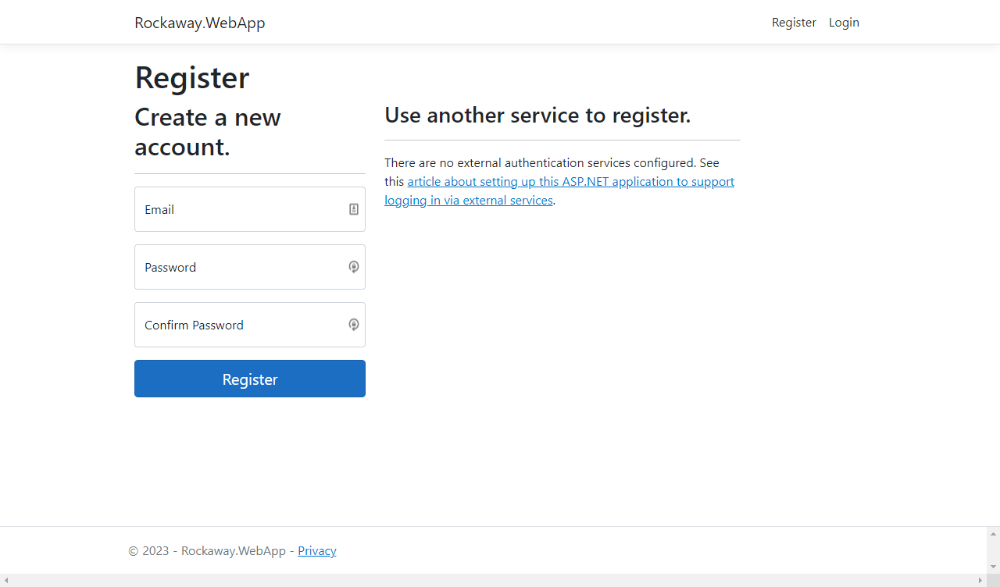

## Scaffolding Identity

ASP.NET Core ships with a full-featured identity provider which supports individual user registration and many external services.

When it comes to adding identity to your application, you can use the UI that's provided as part of the Identity package, you can override individual pages, or you can get the ASP.NET tooling to generate local copies of the entire identity system which you can customise as required.

In this workshop, we're going to use the built-in UI for all our identity and authentication.

First, install the NuGet packages:

```
dotnet add Rockaway.WebApp package Microsoft.AspNetCore.Identity.EntityFrameworkCore
dotnet add Rockaway.WebApp package Microsoft.AspNetCore.Identity.UI
```

Next, we'll make `RockawayDbContext` inherit from `IdentityDbContext<IdentityUser>`, so that it inherits all the entities and collections used for identity management:

```csharp
using Microsoft.AspNetCore.Identity.EntityFrameworkCore;
using Microsoft.AspNetCore.Identity;
using Rockaway.WebApp.Data.Entities;
using Rockaway.WebApp.Data.Sample;

namespace Rockaway.WebApp.Data;

// We must declare a constructor that takes a DbContextOptions<RockawayDbContext>
// if we want to use ASP.NET to configure our database connection and provider.
public class RockawayDbContext(DbContextOptions<RockawayDbContext> options)
	: IdentityDbContext<IdentityUser>(options) {
```

Create `/Pages/Shared/_LoginPartial.cshtml`:

```html

```

Add `_LoginPartial` to `_Layout.cshtml`, just after the `<ul>` inside the page navigation:

```
            </ul>
            <partial name="_LoginPartial" />
        </div>
    </div>
</nav>
```

Edit `_ViewImports.cshtml` and add:

```
@using Microsoft.AspNetCore.Identity
```

and finally, in `Program.cs`:

```csharp
using Microsoft.AspNetCore.Identity;
using Microsoft.AspNetCore.Identity.EntityFrameworkCore;

// add this before builder.Build()
builder.Services.AddDefaultIdentity<IdentityUser>().AddEntityFrameworkStores<RockawayDbContext>();
```

That should give us a full user registration and login system:



Because we're using Sqlite with an in-memory database, we can register and log in -- but when our app restarts, our user account gets wiped.

Let's add a sample user to our seed data so we always have a valid user account when running in `Development` mode:

### Add a sample user

To add a sample user:

```csharp
// Rockaway.WebApp/Data/Sample/SampleData.Users.cs


```

and then at the end of `RockawayDbContext.OnModelBuilding`, add:

```
modelBuilder.Entity<IdentityUser>().HasData(SampleData.Users.Admin);
```

Now we can sign in as `admin@rockaway.dev` with the password `p@ssw0rd`.

> **Remember to delete or disable this account when you deploy to a real production system**

## DB Migrations for Identity

Now, we need to create the migration:

```
dotnet ef migrations add AddAspNetIdentity -- --environment Staging
```

If you look at the migration code that's been generated, you'll see that it's generated some rather odd table names:

```csharp
migrationBuilder.CreateTable(
    name: "IdentityUserClaim<string>",

```

While we *can* have a table called `IdentityUserClaim<string>` in SQL Server, it's probably not a good idea.

In our `OnModelCreating` method, we have this snippet of code to override EF Core's default table names:

```csharp
// Override EF Core's default table naming (which pluralizes entity names)
// and use the same names as the C# classes instead
foreach (var entity in modelBuilder.Model.GetEntityTypes()) {
    entity.SetTableName(entity.DisplayName());
}
```

We need to modify this method so that it'll only affect entities which are part of our Rockaway application, otherwise it'll also override the table names used by the ASP.NET Identity libraries (which is where the weird names are coming from)

First, remove the migration:

```
dotnet ef migrations remove -- --environment Staging
```

Next, replace our table naming code with this:

```csharp
// Override EF Core's default table naming (which pluralizes entity names)
// and use the same names as the C# classes instead
var rockawayEntityNamespace = typeof(Artist).Namespace;
var rockawayEntities = modelBuilder.Model.GetEntityTypes().Where(e => e.ClrType.Namespace == rockawayEntityNamespace);
foreach (var entity in rockawayEntities) entity.SetTableName(entity.DisplayName());
```

Recreate and inspect the migration:

```
dotnet ef migrations add AddAspNetIdentity -- --environment Staging
dotnet format
```

Sweet.

Let’s check the migration works when we run it locally:

```
dotnet ef database update -- --environment Staging
```

And assuming that's all good? **Ship it!**

