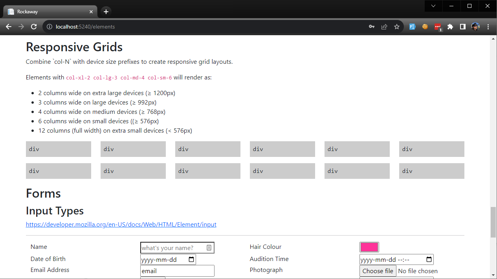
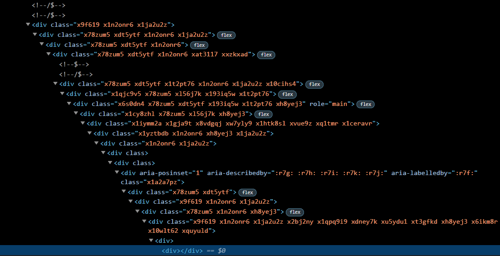
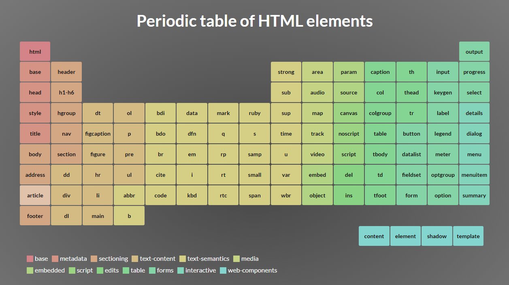

Before we start changing our frontend look and feel, let's create a page which uses all the elements we're going to be using in our app. This gives us a really easy way to check everything works, test responsive designs across multiple devices, and validate changes to our HTML and CSS.

We'll create `/Pages/Elements.cshtml` - you can find the code for this page here: **[Elements.cshtml](examples/501/Rockaway.WebApp/Pages/Elements.cshtml)**

We'll also need to add a directive to our layout, because our elements page injects some custom CSS into the page head. Add this at the end of the `<head>` element in `_Layout.cshtml`:

```csharp
@await RenderSectionAsync("Head", required: false)
```

Now, browse to `/elements` and you should see a page full of HTML elements:



## Customising Bootstrap

All the ASP.NET templates use the Bootstrap frontend library, which is a great library - but out of the box, it means our website looks exactly like every other Bootstrap website in the world.

Let's fix that.

We're going to switch from using precompiled Bootstrap to using the Bootstrap SCSS source files, which lets us override colours and fonts, and gives us the option to use specific Bootstrap modules instead of having to use the entire library.

## We ❤ Semantic Markup

Many modern websites are built using frameworks which produce markup like this:



That's not how do things around here. In this workshop, we're going to use **semantic markup**. Our page header will be a `<header>` tag, our footer will be a `<footer>`. The main bit of the page will be `<main>`. We'll organise content using `<section>`, we'll use `<nav>` and `<label>` and `<fieldset>` and all the other weird and wonderful tags that browsers know about.

> The Mozilla Developer Network has a great [overview of semantic HTML](https://developer.mozilla.org/en-US/docs/Glossary/Semantics#semantics_in_html) if you've never come across it before.



<figcaption>The Periodic Table of HTML elements: <a href="https://madebymike.github.io/html5-periodic-table/">madebymike.github.io/html5-periodic-table</a></figcaption>

## Syntactically Awesome Stylesheets

Cascading Style Sheets -- CSS -- is one of the technologies that developers love to hate. Working with poorly authored CSS can be a horribly frustrating experience.


CSS doesn't have to be horrible, though.

We're going to use a technology called SASS, that gives us far more power and flexibility when it comes to creating and managing the CSS that's used on our site. You can read all about SASS at https://sass-lang.com/.

### SASS vs SCSS

The SASS compiler actually supports two different dialects of "awesome CSS":

SASS is a completely original syntax which, to my mind, looks like CSS would if it was invented by Python developers:

```scss
/* SASS - using the .sass file extension */
$primary-color: green
$background-color: red
$fontsize: 25px

body
	color: $primary-color
	background: $background-color
	font-size: $fontsize
```

SCSS extends the basic CSS syntax with support for SASS features like variables, loops and functions:

```scss
/* SCSS - using the .scss file extension */
$bgcolor: blue;
$textcolor: red;
$fontsize: 25px;

body {
  background-color: $bgcolor;
  color: $textcolor;
  font-size: $fontsize;
}
```

I prefer SCSS, because I like curly braces, so that's what we're going to use in this workshop.

### Running SASS in ASP.NET Core

There are several ways to run SASS as part of an ASP.NET web application. There's a Visual Studio extension called Web Compiler which compiles SASS as part of our development process, and there are various extensions which add SASS plugins for VS Code.

There's also a NuGet package called AspNetCore.SassCompiler, which will compile SCSS as part of your project build.

> The SASS compiler is written in a programming language called Dart. Rather than porting SASS to .NET, the SassCompiler project embeds the Dart interpreter and runs the native dart-sass implementation. Most of the time, this works brilliantly. Very occasionally, when running it on localhost using "watch mode", the dart.exe process won't shut down cleanly -- so if your Windows task manager reports a stray copy of `dart.exe` still running in the background, that's where it came from. On production systems, dart is only invoked during the project build so never runs on your live servers.

We're going to install the SASS compiler into Rockaway.WebApp:

```
dotnet add Rockaway.WebApp package AspNetCore.SassCompiler
```

Next, based on [these instructions](https://github.com/koenvzeijl/AspNetCore.SassCompiler#examples) we're going to add SASS support to our `appsettings.json` file:

```json

```

and then modify our `Program.cs` to enable the Sass Watcher component, which will rebuild our CSS whenever a .scss file is modified:

```csharp
#if DEBUG
builder.Services.AddSassCompiler();
#endif
```

We're using **conditional compilation** here. The code between `#if` and `#endif` will only be compiled when we're running a build with the `DEBUG` symbol defined; when we do a release-mode build, that code disappears completely. This is great for things like the SASS watcher which are useful for developers, but shouldn't be running anywhere near our live systems.

## SassCompiler vs Tests: Fun & Games

After adding `builder.Services.AddSassCompiler();` to `Program.cs`, I started getting weird intermittent test failures.

This... sucks. Tests need to be reliable otherwise there's no point having them. A bit of digging suggests that spinning up multiple instances of our web app in rapid succession - which happens when we use the `WebApplicationFactory` -- causes problems with the way `SassCompiler` hosts the `dart` executable that's used to actually compile our SASS.

But... we don't need runtime SASS compilation in our tests, so we don't actually need to add the SASS compiler when we're using `WebApplicationFactory`. So, how do we turn it off?

#### Run tests in release mode

The easiest way is to run tests in release mode, which is what we're doing in our GitHub Actions deployment script:

```
dotnet test -c Release
```

#### Remove the SassCompilerHostedService

The "proper" way to do this is to remove the service when we set up our `WebApplicationFactory`:

```csharp
await using var factory = new WebApplicationFactory<Program>()
    .WithWebHostBuilder(builder => {
        builder.ConfigureServices(services => services.Remove<SassCompilerHostedService>());
    });
```

Problem is, the `SassCompilerHostedService` is part of the `AspNetCore.SassCompiler` package, and is marked`internal`, so we can't actually get to it at the point where we need to remove it. We can work around this in various ways, such as inspecting the service implementation type name to find the one we want to remove:

```csharp
await using var factory = new WebApplicationFactory<Program>()
    .WithWebHostBuilder(builder => {
        builder.ConfigureServices(services => {
            var sassCompiler = services.FirstOrDefault(s =>
            	(s.ImplementationType?.FullName ?? String.Empty).Contains("SassCompilerHostedService"));
            if (sassCompiler != default) services.Remove(sassCompiler);
        });
    });
```

#### Use conditional compilation symbols

We've already wrapped the offending line in a `#if DEBUG` check.

I use [NCrunch](https://www.ncrunch.net/) as my test runner, and NCrunch sets a conditional compilation symbol called `NCRUNCH`, so in my particular scenario I can make sure I don't register the `SassCompilerHostedService` when NCrunch is running my tests:

```csharp
#if DEBUG && !NCRUNCH
builder.Services.AddSassCompiler();
#endif
```

That's good enough for me: I get reliable tests when debugging them in NCrunch, I get runtime compilation of my SASS files when running my app in debug mode, and I can stick to release mode for CI build, test and deployments.

## Customising Bootstrap

There is a bootstrap.sass package on NuGet. **DO NOT USE IT.** It doesn't work and I have no idea why it even exists.

Instead, get the the Bootstrap SASS source code from [Bootstrap's download page](https://getbootstrap.com/docs/5.3/getting-started/download/) and unzip it.

Direct download link: [**https://github.com/twbs/bootstrap/archive/v5.3.2.zip**](https://github.com/twbs/bootstrap/archive/v5.3.2.zip)

Open up the ZIP, and copy `scss/*` folder from the download to `wwwroot/lib/bootstrap/dist/scss/*` so you end up with this folder structure:

```
Rockaway.WebApp/
  wwwroot/
    lib/
      bootstrap/
        dist/
        scss/		     <-- create this folder
          forms/
          helpers/
          mixins/
          utilities/
          _accordion.scss
          _alert.scss
          ...
```

Create a new file `wwwroot/scss/frontend.scss`

```scss
// 1. Include functions first (so you can manipulate colors, SVGs, calc, etc)
@import "../lib/bootstrap/scss/functions";

// 2. Include any default variable overrides here

// 3. Include remainder of required Bootstrap stylesheets (including any separate color mode stylesheets)
@import "../lib/bootstrap/scss/variables";
@import "../lib/bootstrap/scss/variables-dark";

// 4. Include any default map overrides here

// 5. Include remainder of required parts
@import "../lib/bootstrap/scss/maps";
@import "../lib/bootstrap/scss/mixins";
@import "../lib/bootstrap/scss/root";

// 6. Optionally include any other parts as needed
// @import "../lib/bootstrap/scss/utilities";
// @import "../lib/bootstrap/scss/reboot";
// @import "../lib/bootstrap/scss/type";
// @import "../lib/bootstrap/scss/images";
// @import "../lib/bootstrap/scss/containers";
// @import "../lib/bootstrap/scss/grid";
// @import "../lib/bootstrap/scss/helpers";

// ...or import the whole Bootstrap library:
@import "../lib/bootstrap/scss/bootstrap.scss";

// 7. Optionally include utilities API last to generate classes based on the Sass map in `_utilities.scss`
@import "../lib/bootstrap/scss/utilities/api";

// 8. Add additional custom code here
```

> This is based on the "Customising Bootstrap" technique which is documented at [https://getbootstrap.com/docs/5.3/customize/sass/#importing](https://getbootstrap.com/docs/5.3/customize/sass/#importing) - but with the references to `node_modules` replaced with our `lib` folder structure.

Now we're going to split our layout into a `_Base` layout, which imports CSS and JS files but doesn't add any visible elements to the page, and a `_Layout` which adds the common page header and footer elements.

> Note that our Base page adds the `data-bs-theme="dark"` attribute to the `<html>` element:
>
> <html lang="en" data-bs-theme="dark">
>
> That'll switch Bootstrap into dark mode. If you want to allow your users to toggle dark mode, you'll need to write some custom code to add/remove this attribute from the HTML element, and make sure all your styles and colors are tested in both light mode and dark mode.

The code for **Rockaway/Rockaway.WebApp/Pages/Shared/_Base.cshtml**:

```html

```

The code for **Rockaway/Rockaway.WebApp/Pages/Shared/_Layout.cshtml**:

```html

```

Now, rebuilt the site, open the /Elements page, and you should see basically the same layout as we had before.

#### Watch out for scoped CSS!

ASP.NET Core allows you to add stylesheets which only affect specific parts of your website. The default project template includes `_Layout.cshtml.css`, which defines a set of styles that will **only be applied to pages which use `_Layout.cshtml`**; the runtime does this by

There's also a Bootstrap "cheat sheet" page, which I've adapted to work with ASP.NET Core so you can see how your customisations affect various components and widgets that are provided by Bootstrap.

You can find the code for`/Pages/BootstrapCheatsheet.cshtml` here: **[BootstrapCheatsheet.cshtml](examples/501/Rockaway.WebApp/Pages/BootstrapCheatsheet.cshtml)**

### Change some stuff!

Experiment with overriding the various defaults provided in the `frontend.scss` file. Check out [the Bootstrap documentation](https://getbootstrap.com/docs/5.2/customize/sass/#variable-defaults) to learn more about customising Bootstrap by overriding the default variables.

### Using Google Fonts

If you want to import a custom font, SCSS works quite happily with Google Fonts' CSS import syntax. Personally, I really like [PT Sans Narrow](https://fonts.google.com/specimen/PT+Sans+Narrow), so let's use that:

```scss
@import url('https://fonts.googleapis.com/css2?family=PT+Sans+Narrow:wght@400;700&display=swap');
$font-family-sans-serif: 'PT+Sans+Narrow', Arial, Helvetica, sans-serif;
```

I'm also going to override our site's colour scheme.

First, switch the whole site into 'dark mode' by adding `data-bs-theme="dark"` to the `<html>` element in `_Base.cshtml`

Then, we're going to tweak the background color, because dark mode isn't *quite* dark enough, and set the primary colour:

```scss
$body-bg-dark: #000;
$primary: #336699;
```

The final `frontend.scss` looks like this:

```scss

```


