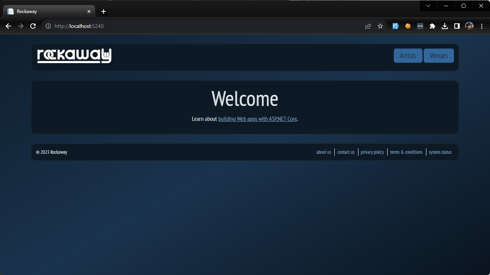

So far, we've looked at how to customise Bootstrap's colours, fonts and other built-in elements.

Now we're going to create some elements of our own, and use SCSS to style our page layout.

First, our `_Layout` page is full of stuff that doesn't *really* need to be there.

> *“Perfection is achieved, not when there is nothing more to add, but when there is nothing left to take away.”* 
>
> ​	― **Antoine de Saint-Exupéry,** [Airman's Odyssey](https://www.goodreads.com/work/quotes/11753)

Let's strip it back:

First, open `_Base.cshtml` and add `class="container"` to our `body` element. This means we can use Bootstrap's grid layout without having to add any more special markup.

Next, modify `_Layout.cshtml`:

```html

```

Now we're going to update our `frontend.scss` to target the new minimal page structure.

We'll use the `sass.color` library to manipulate colors in our custom styles. Right at the top of page, add:

```scss
@use "sass:color";
```

Create a CSS background gradient on our `html` element:

```scss
html {
	background: linear-gradient(150deg, color.scale($primary, $lightness: -70%) 0%, color.scale($primary, $lightness: -50%) 50%, color.scale($primary, $lightness: -80%) 100%);
	background-attachment: fixed;
}
```

We'll create a SCSS mixin for elements of our page which should be visually distinct -- I've called this `fancy-panel` -- and include this in our `header`, `main` and `footer` elements:

```scss
@mixin fancy-panel($panel-color: color.scale($primary, $lightness: -75%)) {
	margin: $grid-gutter-width 0;
	border-radius: 2 * $border-radius;
	padding: 2 * $border-radius;
	background-color: $panel-color;
	border: 1px solid $body-color;
}

body {
	> header {
		@include fancy-panel;
	}

	> main {
		@include fancy-panel;
	}

	> footer {
		@include fancy-panel;
	}
}
```

## Setting a Site Logo

Our site "logo" is currently an `<h1>` element inside the `<header>`. This is brilliant for accessibility, search engines, screen readers -- almost anything which respects semantic markup will treat a nice big H1 at the top of the page header as a very important indicator of what the page is about.

It looks a bit cheap, though. Our designers have created a Rockaway company [logotype](https://99designs.com/blog/logo-branding/logotype-vs-logomark-vs-logo/), which they've sent us as an SVG file:

[rockaway-logotype.svg](examples/502/Rockaway/Rockaway.WebApp/wwwroot/img/rockaway-logotype.svg)


We're going to replace that H1 with the site logotype, and we're going to do it using pure CSS. 

Grab a copy of the SVG file and save it as `Rockaway.WebApp/wwwroot/img/rockaway-logotype.svg`

We'll apply a layout rule to the `header` so that it'll render using a CSS `flex` layout:

> CSS Flexbox offers far more options and capabilities than we have time to explore in this workshop. If you want to know more about it, check out [A Complete Guide to Flexbox](https://css-tricks.com/snippets/css/a-guide-to-flexbox/) at css-tricks.com

```scss
body {
	> header {
		@include fancy-panel;
		display: flex;
		justify-content: space-between;
        
		h1 a {
			display: block;
			font-size: 0;
			height: 38px;
			width: 200px;
			background: url(/img/rockaway-logotype.svg) left center no-repeat;			
		}
	}	
}
```

OK, let's style the site navigation menu:

```scss
body {
	> header {
        nav {
			a {
				background: $primary;
				display: inline-block;
				padding: 4px 16px;
				color: $body-color;
				font-size: 120%;
				border-radius: $border-radius;
				text-decoration: none;

				&:hover {
					color: $body-color;
					background: color.scale($primary, $lightness: -50%);
				}
			}
		}
    }
}
```

and while we're here, we'll apply a flex layout and style the footer element as well:

```scss
> footer {
    @include fancy-panel;		
    font-size: 80%;
    display: flex;
	flex-flow: row wrap;
    justify-content: space-between;
    nav {
        a {
            color: $body-color;
            display: inline-block;
            border-left: 1px solid #fff;
            padding: 0 0.5em;
        }

        a:first-child {
            border: none;
        }

        a:hover {
            text-decoration: underline;
        }
    }
}
```

And there we have it.




