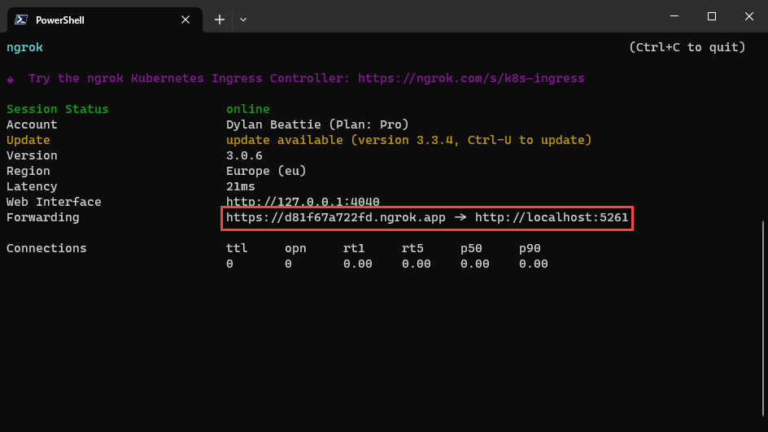

In this module, we're going to use CSS media queries and a few frontend design tricks to create a layout that responds smoothly to different device profiles -- without repeating ourselves or using JavaScript.

First, let's add a mixin that'll make it easy to declare rules which only apply to small screens. There's a set of breakpoints and device sizes already built in to Bootstrap, but we're going to create a new one just to see how they work:

```scss
@mixin smartphone {
	@media (max-width: 480px) {
		@content;
	}
}
```

Now, we can inject that new `smartphone` mixin into our existing `fancy-panel` mixin, to change the way panels render on smartphones:

```scss
@mixin fancy-panel($panel-color: color.scale($primary, $lightness: -75%)) {
	margin: $grid-gutter-width 0;
	border-radius: 2 * $border-radius;
	padding: calc($grid-gutter-width/4) + $border-radius;
	background-color: $panel-color;
	border: 1px solid $body-color;

	@include smartphone {
		border: 0;
		border-radius: 0;
		margin: 0 0 $grid-gutter-width/2 0;
	}
}
```

We'll also use the mixin to remove any padding from the body on smartphone layouts:

```scss
body {
	@include smartphone {
		padding: 0 !important;
	}
}
```

Now refresh the site, resize the window, and see how the layout behaves at different screen widths:


### Responsive Page Footer

Let's use our mixin to give the page footer a different layout at very small display sizes.

```scss
footer {
    @include smartphone {
        margin-bottom: 0;

        span, nav {
            width: 100%;
            text-align: center;
            display: block;
        }

        nav a {
            display: block;
            border: 0;
        }
    }
}
```

#### Responsive Header Nav

Now we'll use a bit of CSS wizardry so that our existing menu will render as a pop-up dynamic menu when we're viewing the site on a mobile device. This is done entirely in CSS, so the HTML markup for our page is exactly the same regardless of what device is being used.

Open up `_Layout.cshtml` and a label to the `<header>` with an associated `<input type="checkbox" />`:

```html
<header>
	<h1>
		<a asp-area="" asp-page="/Index" asp-page="/Index">Rockaway</a>
	</h1>
	<label id="nav-toggle" for="nav-checkbox">NAV</label>
	<input type="checkbox" id="nav-checkbox" />
	<nav>
		<a href="/">home</a>
		<a asp-page="/artists">artists</a>
		<a asp-page="/venues">venues</a>
	</nav>
</header>
```

and CSS rules which use the `smartphone` mixin to control display of these elements:

```scss
body {
	> header {
		label#nav-toggle {
			display: none;
			@include smartphone {
			font-size: 200%;
				display: block;
				position: absolute;
				z-index: 2;
				top: calc($grid-gutter-width/4);
				right: calc($grid-gutter-width/2);
			}
		}

		input#nav-checkbox {
			height: 0;
			@include smartphone {
				&:checked ~ nav {
					height: 300px;
				}
			}
		}
    }
}
```

Finally, we plug in a set of styles for our `nav` element that control how it appears on mobile devices:

```scss
body {
    > header {
	    nav {
            /* existing styles omitted */
			@include smartphone {
				position: absolute;
				overflow-y: hidden;
				display: block;
				top: 0;
				left: 0;
				right: 0;
				height: 0;
				transition: height 0.2s ease;
				a {
					display: block;
					width: 100%;
					padding: 16px;
					border-radius: 0;
					border-bottom: 1px solid $body-color-dark;
                }
            }
		}
	}
}
```

And there it is: we've created a responsive nav menu using only HTML and CSS:

## FontAwesome

One final thing left to tweak: the label at the moment says NAV.

I'd like that to be one of those three-row "hamburger menu" icons that's become an established convention for signifying mobile navigation.


<figcaption>"Click on the hamburger menu"</figcaption>

We *could* build a pseudo-icon by styling up some `<span> tags or something, but instead we're going to take this opportunity to install a library called FontAwesome, which we'll be using throughout the rest of the workshop.

FontAwesome uses web font technology to add responsive icons and images to our web UI.

First, we'll install FontAwesome into our project, based on the docs at :

[https://fontawesome.com/docs/web/use-with/scss#adding-font-awesome-to-your-compile](https://fontawesome.com/docs/web/use-with/scss#adding-font-awesome-to-your-compile)

> *There's a package on nuget.org called FontAwesome. It's seven years old and completely useless. Don't use it.*

Instead, we're going to download the "Free For Web" bundle from [https://fontawesome.com/download](https://fontawesome.com/download)

1. Download [fontawesome-free-6.5.1-web.zip](https://use.fontawesome.com/releases/v6.5.1/fontawesome-free-6.5.1-web.zip)
2. Open up the ZIP file and copy:
   1. Everything from `/font-awesome-free-6.5.1-web/scss/` into a **new folder** `Rockaway.WebApp/wwwroot/lib/fontawesome/scss/`
   2. Everything from `/font-awesome-free-6.5.1-web/webfonts/` into a **new folder** `Rockaway.WebApp/wwwroot/webfonts/`

Now, open up `frontend.scss` and add these lines at the top of our custom code section:

```scss
// 8. Add additional custom code here
@import '../lib/fontawesome/scss/fontawesome.scss';
@import '../lib/fontawesome/scss/solid.scss';
@import '../lib/fontawesome/scss/brands.scss';
```

To check FontAwesome is working properly, try adding a snippet of markup like this to the `Elements` page:

```html
<h2>FontAwesome examples:</h2>
<p>
	<i class="fa-solid fa-hand-spock"></i>
	<i class="fa-solid fa-compact-disc"></i>
	<i class="fa-solid fa-guitar"></i>
	<i class="fa-solid fa-otter"></i>
	<i class="fa-solid fa-jedi"></i>
	<i class="fa-solid fa-stroopwafel"></i>
	<i class="fa-solid fa-user-astronaut"></i>
</p>
<h1>
	<i class="fa-solid fa-hand-spock"></i>
	<i class="fa-solid fa-compact-disc"></i>
	<i class="fa-solid fa-guitar"></i>
	<i class="fa-solid fa-otter"></i>
	<i class="fa-solid fa-jedi"></i>
	<i class="fa-solid fa-stroopwafel"></i>
	<i class="fa-solid fa-user-astronaut"></i>
</h1>
```

If you get a little gallery of icons like this:


then it's working!

OK, back to our nav menu. The icon we're going to use is called `bars`:

<svg xmlns="http://www.w3.org/2000/svg" height="3em" viewBox="0 0 448 512"><!--! Font Awesome Free 6.4.2 by @fontawesome - https://fontawesome.com License - https://fontawesome.com/license (Commercial License) Copyright 2023 Fonticons, Inc. --><path d="M0 96C0 78.3 14.3 64 32 64H416c17.7 0 32 14.3 32 32s-14.3 32-32 32H32C14.3 128 0 113.7 0 96zM0 256c0-17.7 14.3-32 32-32H416c17.7 0 32 14.3 32 32s-14.3 32-32 32H32c-17.7 0-32-14.3-32-32zM448 416c0 17.7-14.3 32-32 32H32c-17.7 0-32-14.3-32-32s14.3-32 32-32H416c17.7 0 32 14.3 32 32z"/></svg>

[https://fontawesome.com/icons/bars?f=classic&s=solid](https://fontawesome.com/icons/bars?f=classic&s=solid)

so we'll edit the `<header>` in our `_Layout.cshtml`:

```html
<label id="nav-toggle" for="nav-checkbox">
    <i class="fa-solid fa-bars"></i>
</label>
```

and then tweak our `styles.scss` to whack up the font size a bit:

```scss
body {
	> header {
		label#nav-toggle {
			@include smartphone {
				font-size: 200%;
			}
		}
	}
}
```

## Testing on real devices using NGrok

That looks pretty good... but is it going to look good on a real mobile device?

Testing page layouts on real devices can often give you an early heads-up about all kinds of layout and usability issues, and those sorts of problems are much easier to fix at this early stage -- so how can we get a real mobile phone browsing localhost?

You *could* connect your phone to the same WiFi network as your development machine, use `ipconfig` to find your local IP address:

``` bash
Windows IP Configuration

Ethernet adapter Ethernet:

   Connection-specific DNS Suffix  . :
   Link-local IPv6 Address . . . . . : fe80::e4ee:4b90:78bb:8d76%6
   IPv4 Address. . . . . . . . . . . : 192.168.0.107
   Subnet Mask . . . . . . . . . . . : 255.255.255.0
   Default Gateway . . . . . . . . . : 192.168.0.1
```

Then disable your Windows firewall 🤫 and then run your website with:

```
dotnet run --urls=http://*:5000/
```

and then browse to http://192.168.0.107:5000/

Alternatively, you can use a tool called **ngrok** - "secure tunnels to localhost"

Download ngrok from [ngrok.com](https://ngrok.com/), and unzip **ngrok.exe** to somewhere you can run it.

> I use the Cygwin tools on all my development machines, and install them into `C:\Windows\Cygwin`, so every Windows machine I use has a folder called `C:\Windows\Cygwin\bin` which is on my system `PATH`. Anything I want to run from the command line, I copy into `C:\Windows\Cygwin\bin`.

Start your web app, watch for port it's listening on:


and then in a separate window, run `ngrok http ` and specify the port number your app is using. Once it's connected, you'll have a real live internet address -- ` https://d81f67a722fd.ngrok.app` in this example -- which you can use to browse your app running on localhost:



One more tip - don't type that URL in! Copy & paste it into an online QR code generator, like [this one](https://ngrok-qr.alanwsmith.com/), and scan the code with your phone camera.

> Get into the habit of checking your designs on a real device every time you create a new page layout, or make a change to your site's CSS.

Based on testing on a real smartphone, I'm going to make the font size a little bigger on mobile devices. I'm using a CSS expression called `max` here, and `1em` is the "default" font size, so what this rule actually says is "hey, if the font would end up smaller than 20px, make it 20px, otherwise don't change it":

```scss
body {
    @include smartphone {
		font-size: max(1em, 20px);
	}
}
```

## Recap and Review

In this module, we've:

* Used a CSS reset to circumvent some of the quirks of browsers' built-in rendering styles
* Learned how to use SCSS mixins and media queries to create responsive layouts
* Created a pure HTML and CSS navigation menu that works on mobile devices
* Added FontAwesome to our project so we can use font-based icons
* Used ngrok to create tunnels to localhost so we can browse our development code from a real mobile device.
