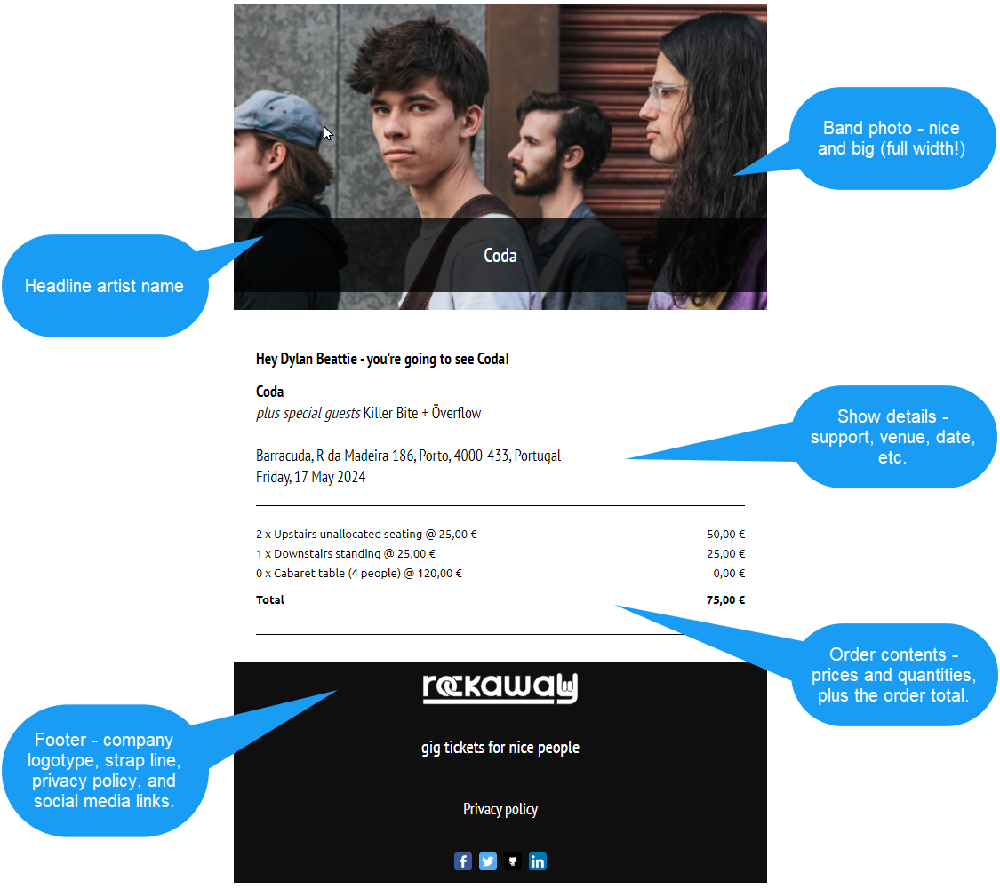
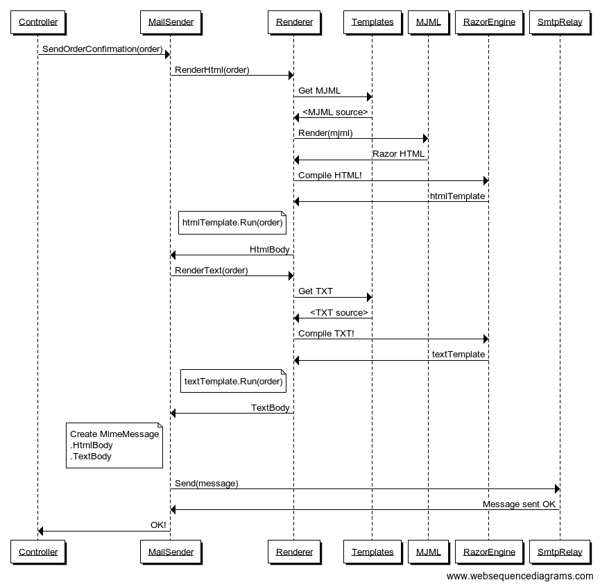

We've chosen our tickets, we've entered our details... this is the part where we get the confirmation email, right? And, because we want to look like we know what we're doing, the email should probably have a nicely-formatted HTML version with some colors and pictures and stuff -- and because accessibility is a thing, we probably also need a clean, readable plain text version.

Before we even think about actually sending the email, let's figure out what it looks like and how we're going to build it. Our designer has provided this:



## Rendering Email with Razor and MJML

HTML email is a nightmare. Gmail, Outlook, iOS Mail, Android Mail, various web mail clients, all with their own interpretations of which HTML tags they support.

>  The Yahoo! Mail app on Android removes the `<head>` element from HTML email messages... but [only the first one](https://github.com/hteumeuleu/email-bugs/issues/28), so if you want to include styles in an HTML message, include two `<head>` elements and put anything important in the second one. That's the kind of idiosyncrasy you'll have to deal with if you're building HTML emails by hand.

Mailjet Markup Language ([mjml.io](https://mjml.io/)) makes it better: instead of writing horrible HTML, we can write MJML, and it'll turn it into HTML for us, so we write this:

```xml

```

and we get this:

```html

```

The good news: there's a [native port of MJML to .NET](https://github.com/SebastianStehle/mjml-net), which is [available on NuGet](https://www.nuget.org/packages/Mjml.Net), so we don't need to install nodeJS.

```dotnetcli
dotnet add package Mjml.Net
```

The bad news: MJML compiles to HTML. It's a transpiler: MJML in, HTML out. There's no way to put in a view model, or template data, or run loops, or logic, or anything.

So, what we're going to do is embed Razor syntax in our MJML, then compile MJML > HTML, hopefully with our Razor markup intact, and then pass the result to a Razor compiler along with a model containing our email data - customer name, artist, tickets, etc.

Here's the full workflow we'll end up with:


<!--
Controller->MailSender: SendOrderConfirmation(order)
MailSender->Renderer: RenderHtml(order)
Renderer->Templates: Get MJML
Templates->Renderer: <MJML source>
Renderer->MJML: Render(mjml)
MJML->Renderer: Razor HTML
Renderer->RazorEngine: Compile HTML!
RazorEngine->Renderer: htmlTemplate
note left of Renderer: htmlTemplate.Run(order)
Renderer->MailSender: HtmlBody
MailSender->Renderer: RenderText(order)
Renderer->Templates: Get TXT
Templates->Renderer: <TXT source>
Renderer->RazorEngine: Compile TXT!
RazorEngine->Renderer: textTemplate
note left of Renderer: textTemplate.Run(order)
Renderer->MailSender: TextBody
note left of MailSender:
Create MimeMessage
.HtmlBody
.TextBody
end note
MailSender->SmtpRelay: Send(message)
SmtpRelay->MailSender: Message sent OK
MailSender->Controller: OK!
-->

Some things to bear in mind:

First, **this is a hack.** It is completely unsupported by the maintainers of the projects involved. When it works, it's glorious. When it doesn't, you aren't going to get useful error messages.

Second, **MJML will remove anything it doesn't recognise**. It preserves its own markup tags, and anything inside what's called an "ending tag" - [read more about ending tags here](https://documentation.mjml.io/#ending-tags).

What this means in practice is that we can do this:

```xml
<mjml>
	<mj-body>
		<mj-section>
			<mj-column>
				<mj-text>
					@foreach(var item in Model.Items) {
					<p>@item</p>
					}
				</mj-text>
			</mj-column>
		</mj-section>
	</mj-body>
</mjml>
```

but we **can't** do this:

```xml
<mjml>
	<mj-body>
		@foreach(var item in Model.Items) {
		<mj-section>
			<mj-column>
				<mj-text>
					<p>@item</p>
				</mj-text>
			</mj-column>
		</mj-section>
		}
	</mj-body>
</mjml>
```

The MailJet compiler wil see the `@foreach(var item in Model.Items) {`, but because it's between `<mj-body>` and `<mj-section>`, it's not valid content and so Mailjet will delete it. (Mailjet has no idea it's Razor code: it treats anything other than its own markup tags as either regular HTML, or invalid content).

### Compiling Razor Views using RazorEngine

To turn the resulting Razor code into populated HTML, we'll install [RazorEngineCore](https://www.nuget.org/packages/RazorEngineCore) from NuGet:

```dotnetcli
dotnet add package RazorEngineCore
```

Now, let's build some classes.

We're going to store our mail templates as part of our project, and we'll set the compilation type to "Embedded Resource", so the template source becomes part of our application assembly -- that way there's no risk of files going missing during deployment.

We'll define an interface for the template provider:

```csharp
// Rockaway.WebApp/Services/Mail/IMailTemplateProvider.cs

```

Then create an implementation based on embedded resource files:

```csharp
// Rockaway.WebApp/Services/Mail/ResourceMailTemplateProvider.cs

```
and another one for debugging, which recompiles everything on every request so we can refresh a page and see the results immediately:

```csharp
// Rockaway.WebApp/Services/Mail/DebugMailTemplateProvider.cs

```
The interface for the mail renderer:

```csharp
// Rockaway.WebApp/Services/Mail/IMailBodyRenderer.cs

```

and the implementation.

```csharp
// Rockaway.WebApp/Services/Mail/MailBodyRenderer.cs

```

> As well as our sneaky Razor markup, there might be @ signs in the MJML code which refer to CSS rules, like `@media`. Before we compile our Razor template, we replace any matching rules like `@media` with `@@media` -- and then the Razor engine turns the `@@` back into a literal `@` in the final HTML.

### The Email Templates

The MJML version of the template is at `Rockaway.WebApp/Templates/Mail/OrderConfirmation.mjml`:

```xml

```

and the text version, which is actually a Razor view that just doesn't include any HTML tags, is at `Rockaway.WebApp/Templates/Mail/OrderConfirmation.txt`:

```

```

### TicketOrderMailData, and Capturing the Website URL

We'll extend `TicketOrderViewData` with the extra fields we need to populate and send order emails:

```csharp
// Rockaway.WebApp/Models/TicketOrderViewData.cs


```

Emails need to include links to our website and images hosted on our website, but our site might have more than one URL. When we're building and testing it, everything's coming from `http://localhost/` somewhere. We might have a staging environment as well as a live environment.

Rather than hard-coding the website URL, we'll capture the URL of the site that was hosting the code when we generated the email, and pass this into the email template when we render it.

```csharp
// Rockaway.WebApp/Services/UriExtensions.cs


```

Then we'll create a new class `TicketOrderMailData`, which extends our existing `TicketOrderViewData` and adds the website base URI, and a`QualifyUri` method we can use to build fully-qualified URIs:

```csharp
// Rockaway.WebApp/Models/TicketOrderMailData.cs


```

## Previewing Emails

We'll add links to the `Areas/Admin/TicketOrders/Index.cshtml` view in the admin area to the HTML and text versions of each order email, and add a new controller action to render the previews.

Add a new constructor parameter `IMailBodyRenderer mailRenderer` to the primary constructor on `TicketOrdersController`.

Add a new action method to `TicketOrdersController`:

```csharp
public async Task<IActionResult> Mail(Guid id, string format = "html") {
    var ticketOrder = await context.TicketOrders
        .Include(o => o.Contents).ThenInclude(item => item.TicketType)
        .Include(o => o.Show).ThenInclude(s => s.HeadlineArtist)
        .Include(o => o.Show).ThenInclude(s => s.Venue)
        .Include(o => o.Show).ThenInclude(s => s.SupportSlots).ThenInclude(ss => ss.Artist)
        .FirstOrDefaultAsync(m => m.Id == id);
    if (ticketOrder == default) return NotFound();
    // ReSharper disable once InvokeAsExtensionMethod
    var data = new TicketOrderMailData(ticketOrder, UriExtensions.GetWebsiteBaseUri(Request));
    switch (format) {
        case "html":
            var html = mailRenderer.RenderOrderConfirmationHtml(data);
            return Content(html, "text/html");
        default:
            var text = mailRenderer.RenderOrderConfirmationText(data);
            return Content(text, "text/plain", Encoding.UTF8);
    }
}
```

We'll add links to the order list page to view the HTML and text versions of each order email.

Open `/Areas/Admin/Views/TicketOrders/Index.cshtml`, add a new column to the table:

```html
<th>Emails</th>
```

and

```html
<td>
    <a asp-action="Mail" asp-route-id="@item.Id" asp-route-format="html">Html</a> |
    <a asp-action="Mail" asp-route-id="@item.Id" asp-route-format="text">Text</a>
</td>
```

Finally, we need to register `MailBodyRenderer` and its various dependent services in `Program.cs`:

```csharp
#if DEBUG
builder.Services.AddSingleton<IMailTemplateProvider>(new DebugMailTemplateProvider());
#else
builder.Services.AddSingleton<IMailTemplateProvider>(new ResourceMailTemplateProvider());
#endif
builder.Services.AddSingleton<IMailBodyRenderer, MailBodyRenderer>();
builder.Services.AddSingleton<IRazorEngine, RazorEngine>();
builder.Services.AddSingleton<IMjmlRenderer, MjmlRenderer>();
```

### Module Checklist

1. Add the `Mjml.Net` NuGet package
2. Add the `RazorEngineCore` NuGet package
3. Create the `IMailBodyRenderer` interface
4. Create the `IMailTemplateProvider` interface
5. Create debug and release implementations of `IMailTemplateProvider`
6. Create `MailBodyRenderer`
7. Inject `IMailBodyRenderer` into `TicketOrdersController` via a new constructor parameter
8. Add the new `Mail()` action  to `TicketOrdersController`
9. Add the Emails column and links to `/Areas/Admin/Controllers/TicketOrdersController.cs`
10. Add extra fields to `TicketOrderViewData`
11. Create the `UriExtensions` helper class in `Services/`
12. Register the new mail services in `Program.cs`
13. Create `Templates/Mail/OrderConfirmation.mjml` and make it an **Embedded Resource**
14. Create `Templates/Mail/OrderConfirmation.txt` and make it an **Embedded Resource**

### Test Plan

1. Build and run Rockaway.WebApp in **Debug** mode
2. Sign in to the admin area
3. Navigate to the Orders page (`/admin/ticketorders`)
4. Click the **Html** link alongside each order. Verify you get an HTML-formatted email with the correct information.
5. Click the **Text** link alongside each order. Verify you get a text formatted email body with the correct information.
6. Repeat for **Release** mode
